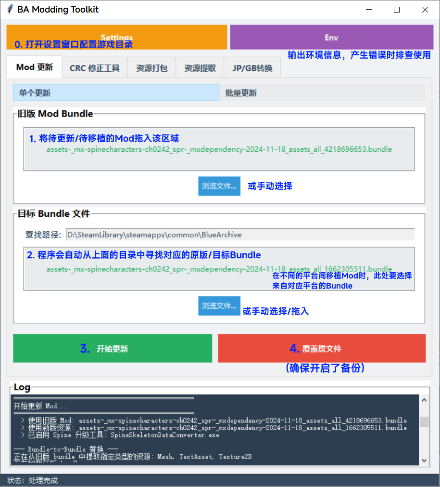

[](https://www.gnu.org/licenses/gpl-3.0)


# BA Modding Toolkit

简体中文 | [English](README.md)

一个用于自动化制作、更新 Blue Archive 游戏的 Mod Bundle 文件流程的工具集。

## 启动程序

### 安装 Python
请确保已安装 Python 3.10 或以上版本。

可以从 [Python 官方网站](https://www.python.org/downloads/) 下载并安装。

当在控制台中输入`python --version`时，应该能看到类似`Python 3.12.4`的输出。

### 安装依赖
```bash
pip install -r requirements.txt
```
如果在这一步遇到了`Failed building wheel`的提示，可能是因为PyPI还未提供兼容版本的UnityPy。请尝试不要使用最新的 Python 3.14，换用稍旧的版本，如 Python 3.13或是3.12。

### 运行程序
```bash
python main.pyw
```
或者直接双击 `main.pyw` 文件启动。

如果无法正常启动，请尝试在控制台中运行下面的命令，查看环境是否配置正确。
```bash
python maincli.py env
```

## 程序界面说明
程序包含多个功能标签页：
- **Mod 更新**：用于更新或移植不同平台的 Mod
  - 单个更新：用于更新单个 Mod 文件
  - 批量更新：用于批量处理多个 Mod 文件
- **CRC 修正工具**：CRC 校验值修正功能
- **资源打包**：将一个文件夹内的资源打包进对应的 Bundle ，替换 Bundle 中的同名资源
- **资源提取**：从 Bundle 文件中提取指定类型的资源
- **JP/GB转换**：日服与国际服格式互相转换

点击主界面上方的 **Settings** 按钮打开高级设置窗口。
程序可以将用户配置保存到 `config.ini` 文件，下次启动时会自动恢复之前的设置。

### 设置界面

<details>
<summary>点击展开查看设置界面详细说明</summary>


#### 目录设置
- **游戏根目录**：设置游戏安装目录。程序能够自动检测资源子目录
- **输出目录**：设置生成文件的保存位置

#### 全局选项
- **CRC 修正**：自动修正 Bundle 文件的 CRC 校验值，防止文件被修改后无法运行
  - 当前仅 Steam 版本 Mod 需要此步骤，其他版本 Mod 可忽略
- 添加私货: 在CRC修正之前添加`0x08080808`。~~确实是私货，不选也没有影响~~
- **创建备份**：在覆盖原文件之前创建原文件的备份
- **压缩方式**：选择 Bundle 文件的压缩方式（LZMA、LZ4、保持原始、不压缩）

#### 资源类型选项
- **Texture2D**：立绘、贴图、纹理资源
- **TextAsset**：`.atlas`、`.skel`文件，Spine使用的骨骼文件
- **Mesh**：3D 模型资源
- **ALL**：所有类型的资源，也包括上面三者之外的类型（实验性，不推荐启用）

#### Spine 转换器（实验性功能）
（可选）使用第三方程序，将一些较老的 Mod 中使用的 Spine 3.8 格式`.skel`文件转换为当前游戏版本支持的 4.2 格式。
- 请自行下载第三方 Spine 转换器程序，BAMT 仅提供调用程序转换功能，不包含该程序本体。
- 下载地址：[SpineSkeletonDataConverter](https://github.com/wang606/SpineSkeletonDataConverter/releases)
- 在设置界面配置`SpineSkeletonDataConverter.exe`程序的路径，并勾选"启用 Spine 转换"选项。
- 配置 `SpineAtlasDowngrade.exe` 程序的路径，可以在**资源提取**时将`.atlas`文件转换为 Spine 3.8 格式。

##### 注意
- 这是一个实验性功能，无法保证所有 mod 都能成功升级，仅适合高级用户尝试。
- 即使不配置 `SpineSkeletonDataConverter.exe`，也可以正常使用本程序来更新*使用与当前版本（4.2.xx）兼容的Spine文件*的 Mod。
  - 如果您想要更新的Mod制作于2025年及之后，则其已经使用了Spine 4.2格式，无需配置该选项也可正常更新。
- `SpineAtlasDowngrade.exe` 程序用于在**资源提取**时，将`.atlas`文件转换为 Spine 3.8 格式，方便Mod制作者编辑。
  - 如果您只是需要更新Mod，无需配置该选项。

</details>

## 使用方法



- 首先，请打开 Settings 窗口，配置好游戏根目录和输出目录。
- 如果是为Steam版更新或制作Mod，请勾选"CRC 修正"选项。
- 建议勾选"创建备份"选项，以防止意外覆盖原文件。
- 点击"Save"按钮保存配置，下次启动时会自动恢复之前的设置。

### Mod 更新
#### 单个更新
1. 拖放或浏览选择需要更新的旧版 Mod Bundle 文件
2. 程序会自动根据资源目录寻找对应目标 Bundle 文件
3. 在设置窗口中勾选需要替换的资源类型
4. 点击"开始更新"按钮，程序会自动处理并生成更新后的 Bundle 文件
5. （可选）成功后点击"覆盖原文件"应用修改。请确保开启了"创建备份"选项以防止风险。

此功能同样适用于在不同平台间移植 Mod，只需在第二步中选择来自对应平台的 Bundle 文件即可。

#### 批量更新
1. 拖放或浏览选择包含多个 Mod 文件的文件夹，或直接拖放多个 Mod 文件
2. 程序会自动识别并列出所有可处理的 Mod 文件
3. 在设置窗口中配置资源类型等选项
4. 点击"开始批量更新"按钮，程序会依次处理所有选中的 Mod 文件

### CRC 修正工具
1. 拖放或浏览选择需要修改的目标 Bundle 文件
2. 程序会自动根据资源目录寻找对应的原版 Bundle 文件
3. 点击"运行 CRC 修正"按钮：自动修正 Bundle 文件的 CRC 校验值
4. （可选）成功后点击"替换原始文件"应用修改。请确保开启了"创建备份"选项以防止风险。

"计算CRC值" 按钮可用于手动查看单个或两个文件的 CRC 校验值。

### 资源打包
1. 拖放或浏览选择包含待打包资源的文件夹
   - 支持的文件类型：`.png`（贴图）、`.skel`、`.atlas`（Spine动画文件）
   - 确保资源文件名与目标 Bundle 文件中的资源名匹配
2. 拖放或浏览选择需要修改的目标 Bundle 文件
3. 点击"开始打包"按钮：执行资源打包操作
4. （可选）成功后点击"覆盖原文件"应用修改。请确保开启了"创建备份"选项以防止风险。

此功能适用于制作新的 Mod，例如快速将修改后的资源打包到 Bundle 文件中。

#### 示例
假设您正在为编号为`CH0808`的角色制作Mod，通过“资源提取”功能将相关立绘资源提取到了`texture`文件夹下。则该目录下应该含有以下文件：
- CH0808_spr.png
- CH0808_spr.atlas
- CH0808_spr.skel

在修改这些文件之后，您可以通过“资源打包”功能将它们打包到一个 Bundle 文件中。

将`texture`文件夹拖放到界面的第一个输入框中，并把对应的 Bundle 文件（例如`*-spinecharacters-ch0808_spr-*.bundle`）拖放至程序的第二个输入框中，点击“开始打包”按钮即可生成新的 Bundle 文件。

这会使`texture`文件夹下的`*.png`、`*.skel`、`*.atlas`文件替换目标Bundle中的同名资源。

### 资源提取
1. 拖放或浏览选择需要提取资源的 Bundle 文件
2. 选择输出目录，程序会自动创建以 Bundle 文件名命名的子目录
3. 在设置窗口中勾选需要提取的资源类型
4. （可选）在设置窗口配置 `SpineAtlasDowngrade.exe` 程序的路径，并开启"启用 Spine 降级"选项，调用第三方程序将提取出的 Spine 文件转换为 Spine 3.8 格式
5. 点击"开始提取"按钮，程序会自动提取指定类型的资源

此功能适用于从现有 Bundle 文件中提取资源进行修改或预览。

### JP/GB转换
日服（两个文件）与国际服（一个文件）格式之间的互相转换。

#### JP -> Global 转换
1. 选择国际服 Bundle 文件（作为基础文件）
2. 选择日服 TextAsset Bundle 与 Texture2D Bundle 文件
3. 点击"开始转换"按钮，程序会从日服的两个 Bundle 提取资源并合并到国际服版本的文件中

#### Global -> JP 转换
1. 选择国际服 Bundle 文件（源文件）
2. 选择日服 TextAsset Bundle 文件与 Texture2D Bundle 文件（作为模板）
3. 点击"开始转换"按钮，程序会将国际服格式的 Bundle 拆分到日服的两个 Bundle 文件中

## 命令行接口 (CLI)

除了图形界面，本项目还提供了一个命令行接口（CLI）版本的程序 `maincli.py`。

目前的 GUI 界面暂未支持国际化（界面仅为中文），但CLI版本的帮助信息、参数说明为英文。如果您习惯使用英文界面或需要在非中文环境下使用，CLI 版本是一个很好的选择。

### CLI 使用方法

所有操作都可以通过 `python maincli.py` 命令执行。您可以通过 `--help` 查看所有可用命令和参数。

```bash
# 查看所有可用命令
python maincli.py -h

# 查看特定命令的详细帮助和示例
python maincli.py update -h
python maincli.py pack -h
python maincli.py crc -h

# 查看环境信息
python maincli.py env
```

<details>
<summary>点击展开查看CLI详细说明</summary>

#### 更新 Mod (update)

用于更新或移植Mod，将旧Mod中的资源迁移到新版的游戏文件中。这是最核心的功能。

**主要参数:**
- `--old`: (必需) 指定旧的 Mod 文件路径。
- `--resource-dir`: 指定游戏资源目录，程序将在此目录中自动查找匹配的新版文件进行更新。
- `--target`: 手动指定新版游戏文件的路径。如果同时提供了 `--resource-dir`，此选项优先。
- `--output-dir`: (可选) 指定生成文件的输出目录 (默认为 `./output/`)。
- `--enable-spine-conversion`: (可选) 启用Spine骨骼转换功能，用于升级旧版Mod。
- `--spine-converter-path`: (可选) 指定 `SpineSkeletonDataConverter.exe` 的完整路径。

**命令示例:**
```bash
# 示例 1: 自动搜索更新
python maincli.py update --old "path/to/old_mod.bundle" --resource-dir "path/to/GameData/Windows"

# 示例 2: 手动指定目标文件进行更新
python maincli.py update --old "old_mod.bundle" --target "new_game_file.bundle" --output-dir "./updated_mods"
```

#### 资源打包 (pack)

将一个文件夹内的资源（如 `.png`, `.skel`, `.atlas`）打包进一个指定的 Bundle 文件中，替换其中的同名资源。

**主要参数:**
- `--bundle`: (必需) 指定要修改的目标 Bundle 文件路径。
- `--folder`: (必需) 指定包含新资源的文件夹路径。
- `--output-dir`: 指定生成文件的输出目录 (默认为 `./output/`)。

**命令示例:**
```bash
# 将 asset_folder 文件夹内的所有资源打包进 target_game_file.bundle
python maincli.py pack --bundle "target_game_file.bundle" --folder "./asset_folder" --output-dir "./packed_mods"
```

#### CRC 修正 (crc)

为修改过的 Bundle 文件修正 CRC 校验值，使其与原版文件一致。

**主要参数:**
- `--modified`: (必需) 指定被修改过的 Mod 文件路径。
- `--resource-dir`: 指定游戏资源目录，用于自动查找对应的原版文件。
- `--original`: 手动指定原版文件路径，用于提取正确的 CRC 值。
- `--check-only`: (可选) 仅检查和对比 CRC 值，不执行任何修改操作。

**命令示例:**
```bash
# 示例 1: 自动查找原版文件并修正 CRC
python maincli.py crc --modified "my_mod.bundle" --resource-dir "path/to/GameData/Windows"

# 示例 2: 手动指定原版文件进行修正
python maincli.py crc --modified "my_mod.bundle" --original "original.bundle"

# 示例 3: 仅检查 CRC 值，不修改文件
# 比较两个文件的CRC
python maincli.py crc --modified "my_mod.bundle" --original "original.bundle" --check-only
# 查看单个文件的CRC
python maincli.py crc --modified "my_mod.bundle" --check-only
```

</details>

### 经过测试的环境

下表列出了经过测试的环境配置，供参考。

| 操作系统 (OS)           | Python 版本 | UnityPy 版本 | Pillow 版本 | 状态  | 备注   |
|:------------------- |:--------- |:---------- |:--------- |:--- | ---- |
| Windows 10          | 3.12.4    | 1.23.0     | 10.4.0    | ✅   | 开发环境 |
| Windows 10          | 3.13.7    | 1.23.0     | 11.3.0    | ✅   |  |
| Ubuntu 22.04 (WSL2) | 3.10.12   | 1.23.0     | 10.4.0    | ✅   |  |
| Ubuntu 22.04 (WSL2) | 3.13.10   | 1.23.0     | 12.0.0    | ✅   |  |

## Linux 支持

- **GUI 兼容性**：GUI 程序基于 `tkinter` 库构建，并使用了 `tkinterdnd2` 实现拖拽功能。由于 Linux 各发行版对 tkinter 的支持情况不一，图形界面可能无法在 Linux 上正常显示或运行。
- **推荐方案**：建议 Linux 用户直接使用 **命令行接口 (CLI)** 版本 `maincli.py`。CLI 版本实现了大部分功能，且不依赖任何 GUI 库，经测试可以正常运行。
- **使用虚拟环境**：为了避免系统环境与依赖库产生冲突，**强烈建议使用 Python 虚拟环境 (venv) 来运行本程序**。

## 开发

作者的编程水平有限，欢迎提出建议或是issue，也欢迎贡献代码以改进本项目。

您可以将 `BA-Modding-Toolkit` 的代码（主要是 `processing.py` 与 `utils.py`）加入您的项目中或是进行修改，以实现自定义的 Mod 制作和更新功能。

`maincli.py` 是一个命令行接口（CLI）版本的主程序，您可以参考其调用处理函数的方式。

### 文件结构

```
BA-Modding-Toolkit/
│ 
│ # ============= 程序 =============
│ 
├── main.pyw    # GUI程序主入口
├── ui/         # 图形界面包
│ ├── app.py        # 主应用 App 类
│ ├── base_tab.py   # TabFrame 基类
│ ├── components.py # UI组件、主题、日志
│ ├── dialogs.py    # 设置对话框
│ ├── utils.py      # UI相关工具函数
│ └── tabs/         # 功能标签页
│   ├── mod_update_tab.py       # Mod 更新标签页
│   ├── crc_tool_tab.py         # CRC 修正工具标签页
│   ├── asset_packer_tab.py     # 资源文件夹打包标签页
│   ├── asset_extractor_tab.py  # 资源提取标签页
│   └── jp_gb_conversion_tab.py # 日服/国际服转换标签页
├── maincli.py       # 命令行接口主入口
├── processing.py    # 核心处理逻辑
├── utils.py         # 工具类和辅助函数
├── i18n.py          # 国际化功能相关
│ 
│ # ============= 杂项 =============
│ 
├── locales/         # 语言文件
├── requirements.txt # Python依赖列表
├── config.ini       # 本地配置文件（自动生成）
├── LICENSE          # 项目许可证文件
├── assets/          # 项目资源文件夹
│ └── help/              # 帮助文档中的图片
├── README_zh-CN.md  # 项目说明文档（中文，本文件）
└── README.md        # 项目说明文档
```

## 鸣谢

- [Deathemonic](https://github.com/Deathemonic): 基于 [BA-CY](https://github.com/Deathemonic/BA-CY) 项目实现 CRC 修正功能。
- [kalina](https://github.com/kalinaowo): 创建了 `CRCUtils` 类的原型，也是 BAMT 项目的起点。
- [afiseleo](https://github.com/fiseleo): 协助开发命令行版本。
- [wang606](https://github.com/wang606): Spine 版本转换功能基于 [SpineSkeletonDataConverter](https://github.com/wang606/SpineSkeletonDataConverter) 项目。
  - SpineSkeletonDataConverter 是一个独立的第三方程序，当下载并使用时请遵守其协议。BA Modding Toolkit 不会包含、分发该程序的任何代码或文件，也不负责其使用过程中可能出现的任何问题。

本项目使用了以下优秀的第三方库：

- [UnityPy](https://github.com/K0lb3/UnityPy): 用于解析和操作 Unity Bundle 文件的核心库
- [Pillow](https://python-pillow.github.io/): 用于处理游戏中的纹理资源
- [tkinterdnd2](https://github.com/pmgagne/tkinterdnd2): 为 Tkinter 添加拖放功能支持